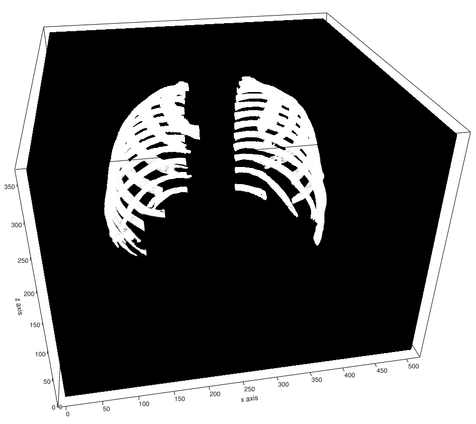
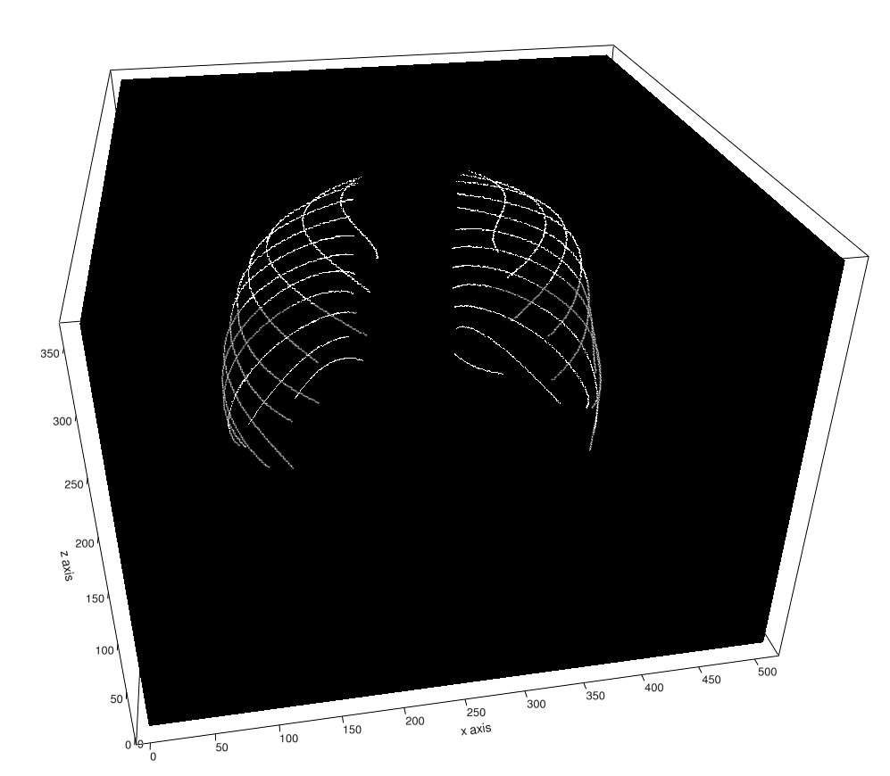

# RibSeg 

##### Please see the RibSeg v2 [paper](https://arxiv.org/abs/2210.09309) on IEEE TMI 2023.
##### For code of RibSeg v2, please refer to the branch [ribsegv1](https://github.com/M3DV/RibSeg/tree/ribsegv2).
##### For code of RibSeg v1, please refer to the branch [ribsegv1](https://github.com/M3DV/RibSeg/tree/ribsegv1).

#### Released! Welcome to use and leave comments! Please cite [RibSeg v2](https://arxiv.org/abs/2210.09309)!

##### RibSeg v2 [dataset](https://drive.google.com/file/d/1ZZGGrhd0y1fLyOZGo_Y-wlVUP4lkHVgm/view?usp=sharing), [description document](https://docs.google.com/spreadsheets/d/1lz9liWPy8yHybKCdO3BCA9K76QH8a54XduiZS_9fK70/edit?usp=sharing), and [annotations as mesh](https://drive.google.com/file/d/1b_qcg99efU8cF2pXshl2ZFxi4LCQOmpw/view?usp=sharing) here. 

##### To load the data:
seg:
import nibabel as nib
seg = nib.load(file name).get_fdata() # seg is a np array / volume of (512,512,N) with rib labels

cl:
import numpy as np
cl = np.load(file name)['cl'] # cl is a np array of (24,500,3), each rib contains 500 points


## Paper ([MICCAI'21](http://arxiv.org/abs/2109.09521)) | Dataset ([Zenodo](https://doi.org/10.5281/zenodo.5336592))

[Jiancheng Yang](https://jiancheng-yang.com/), [Shixuan Gu](https://shixuan-gu.me/), [Donglai Wei](https://donglaiw.github.io/), [Hanspeter Pfister](https://scholar.google.com/citations?user=VWX-GMAAAAAJ&hl=en), [Bingbing Ni](https://scholar.google.com/citations?user=eUbmKwYAAAAJ)


Manual rib inspections in computed tomography (CT) scans are clinically critical but labor-intensive, as 24 ribs are typically elongated and oblique in 3D volumes. Automatic rib segmentation methods can speed up the process through rib measurement and visualization. However, prior arts mostly use in-house labeled datasets that are publicly unavailable and work on dense 3D volumes that are computationally inefficient. To address these issues, we develop a labeled rib segmentation benchmark, named RibSeg, including 490 CT scans (11,719 individual ribs) from a public dataset. For ground truth generation, we used existing morphology-based algorithms and manually refined its results. Then, considering the sparsity of ribs in 3D volumes, we thresholded and sampled sparse voxels from the input and designed a point cloud-based baseline method for rib segmentation. The proposed method achieves state-of-the-art segmentation performance (Dice≈95%) with significant efficiency (10∼40× faster than prior arts). 

## Dataset

The RibSeg Dataset contains annotations for both rib segmentation and centerline.

| Rib Segmentation      | Rib Centerline |
| ----------- | --------------- | 
|      |              | 

Overview of RibSeg dataset:

| Subset      | No. of CT Scans | No. of Individual Ribs |
| ----------- | --------------- | ---------------------- |
| Training    | 320             | 7,670                  |
| Development | 50              | 1,187                  |
| Test        | 120             | 2,862                  |


## Model Training (RibSeg v1)

For training data, please download the source CT scans from RibFrac Dataset to **./data/ribfrac** directory:

### Download

For the source CT scans, please refer to the MICCAI 2020 RibFrac Challenge on [grand-challenge.org](https://ribfrac.grand-challenge.org/) (click `Join` first). 

For annotations, please download RibSeg dataset to **./data/ribseg** directory on [Zenodo](https://doi.org/10.5281/zenodo.5336592).

### Data Preparation

run data_prepare.py to create data for training.

Based on RibFrac dataset and RibSeg dataset, we binarized the CT scans and the annotations for rib segmentation to **./data/pn** for the convenience of training PointNet++. 

### Model 

You can train your model through the following command line:

```python
python train_ribseg.py --model pointnet2_part_seg_msg --log_dir <model_directory>
```

You can test your model through the following command line:

```python
python test_ribseg.py --log_dir <model_directory>
```

You can conduct inference through the following command line:

```python
python inference.py --log_dir <model_directory>
```

You can run our model through the following command line:

```python
python inference.py --log_dir c2_a
```

You can get the volume-wise test result through the following command line:

```python
python post_proc.py
```

# Citation
If you find this project useful, please cite our paper as:

    Liang Jin, Shixuan Gu, Donglai Wei, Jason Ken Adhinarta, Kaiming Kuang, Yongjie Jessica Zhang, Hanspeter Pfister, Bingbing Ni, Jiancheng Yang, Ming Li. "RibSeg v2: A Large-scale Benchmark for Rib Labeling and Anatomical Centerline Extraction". IEEE Transactions on Medical Imaging (TMI), 2023.
    
    Jiancheng Yang, Shixuan Gu, Donglai Wei, Hanspeter Pfister, Bingbing Ni. "RibSeg Dataset and Strong Point Cloud Baselines for Rib Segmentation from CT Scans". International Conference on Medical Image Computing and Computer-Assisted Intervention (MICCAI), 2021.

or using bibtex:

    @article{ribsegv2,
      title={RibSeg v2: A Large-scale Benchmark for Rib Labeling and Anatomical Centerline Extraction},
      author={Jin, Liang and Gu, Shixuan and Wei, Donglai and Adhinarta, Jason Ken and Kuang, Kaiming and Zhang, Yongjie Jessica and Pfister, Hanspeter and Ni, Bingbing and Yang, Jiancheng and Li, Ming},
      journal={IEEE Transactions on Medical Imaging (TMI)},
      year={2023},
      publisher={IEEE}
    }

    @inproceedings{ribsegv1,
      title={RibSeg Dataset and Strong Point Cloud Baselines for Rib Segmentation from CT Scans},
      author={Yang, Jiancheng and Gu, Shixuan and Wei, Donglai and Pfister, Hanspeter and Ni, Bingbing},
      booktitle={International Conference on Medical Image Computing and Computer-Assisted Intervention (MICCAI)},
      pages={611--621},
      year={2021},
      organization={Springer}
    }
